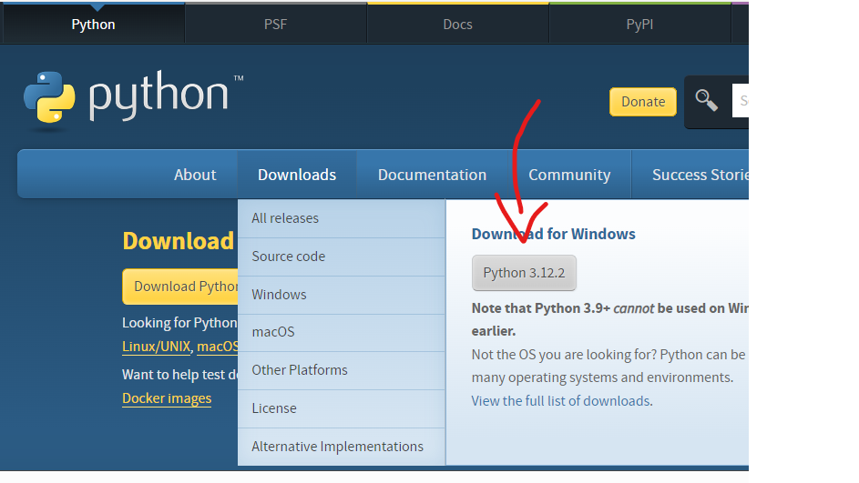
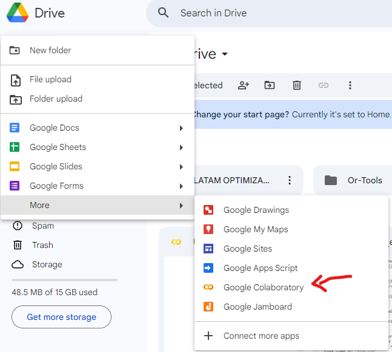
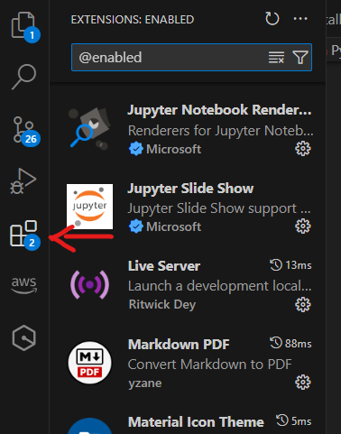
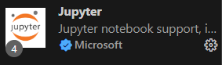
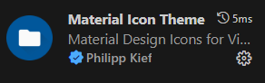

# 🚀 Generación de data test con Python 🐍📊

Para este curso hay dos opciones de trabajo:

1. Instalar Visual Studio Code (VSC) o editor de codigo de tu preferencia, e instalar Python:

    - Para instalar VSC lo podemos hacer descargándolo desde su página oficial: [Visual Studio Code](https://code.visualstudio.com/).
    
    
    
    Te dejamos un [video tutorial](https://www.youtube.com/watch?v=X_Z7d04x9-E) para que te sientas más seguro al instalarlo.
    
    - Para instalar [Python](https://www.python.org/downloads/) también lo hacemos desde su página oficial.

    
    De igual manera te dejamos un [video tutorial](https://www.youtube.com/watch?v=UiQGhWZ7UHU)

2. Tener una cuenta de Google para usar Google Colaboratory
    - Te dejamos un [video tutorial](https://www.youtube.com/watch?v=h_KT_ZThlmY) para abrir tu cuenta de Google.

    

---
### En caso de descargar VSC y Python te damos unos tips con extensiones de VSC que mejoraran el aspecto visual y productividad del editor.

Puedes ir a la sección de extensiones y buscar cada una o puedes dar click en cada enlace.

- [Jupyter](https://marketplace.visualstudio.com/items?itemName=ms-toolsai.jupyter):

    

- [Material Icon Theme](https://marketplace.visualstudio.com/items?itemName=PKief.material-icon-theme):

    

- [Prettier](https://marketplace.visualstudio.com/items?itemName=esbenp.prettier-vscode):

    

- [Python](https://marketplace.visualstudio.com/items?itemName=ms-python.python):

    

## Esperamos que disfrutes el taller que hemos hecho para ti. ❤️