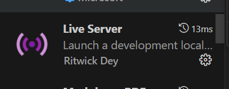
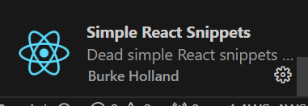

# 🚀 Taller: Creación de Aplicaciones Web con React-JS 💻

Para poder tomar el curso sin perder tiempo en instalaciones te recomendamos tener instaladas estas herramientas en tu ordenador:

1. Instalar Visual Studio Code (VSC) o editor de codigo de tu preferencia:

    - Para instalar VSC lo podemos hacer descargándolo desde su página oficial: [Visual Studio Code](https://code.visualstudio.com/).
    
    
    
    Te dejamos un [video tutorial](https://www.youtube.com/watch?v=X_Z7d04x9-E) para que te sientas más seguro al instalarlo.

2. Intalar [Node.js](https://nodejs.org/en), te recomendamos seguir la instalacion recomendada y reiniciar tu ordenador después de la instalación. Al igual aquí tienes un [video de referencia](https://www.youtube.com/watch?v=dsvCofDdTVA).

    

3. En el curso haremos uso de una biblioteca llamada [Material UI](https://mui.com/), la cual nos ayudará a crear componentes más fácil y rápido, te recomendamos ejecutar los siguientes tres comandos **EN EL DESARROLLO DEL TALLER**, sin embargo, si quieres hacer uso de la biblioteca para hacer pruebas previas, te dejamos los comandos:

    

    - Comandos (no incluir `$`):

    ```sh
    $ npm install @mui/material @emotion/react @emotion/styled
    $ npm install @mui/material @mui/styled-engine-sc styled-components
    $ npm install @mui/icons-material  
    ```

---
### En caso de descargar VSC te damos unos tips con extensiones de VSC que mejoraran el aspecto visual y productividad del editor.

Puedes ir a la sección de extensiones y buscar cada una o puedes dar click en cada enlace.


- [Live Server](https://marketplace.visualstudio.com/items?itemName=ritwickdey.LiveServer):

    

- [Material Icon Theme](https://marketplace.visualstudio.com/items?itemName=PKief.material-icon-theme):

    

- [Prettier](https://marketplace.visualstudio.com/items?itemName=esbenp.prettier-vscode):

    

- [Simple React Snippets](https://marketplace.visualstudio.com/items?itemName=burkeholland.simple-react-snippets):

    

## Esperamos que disfrutes el taller que hemos hecho para ti. ❤️