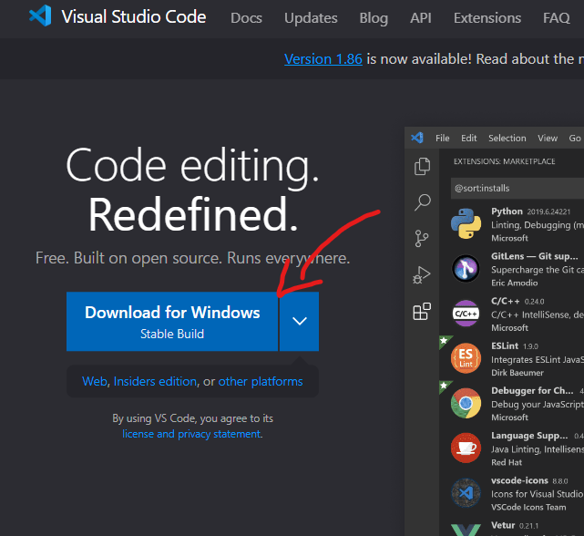
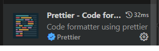
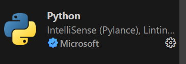

# 🚀 Generación de data test con Python 🐍📊
Para este curso hay dos opciones de trabajo

1. Instalar Visual Studio Code (VSC) o editor de codigo de tu preferencia, e intalar python
    - Para instalar VSC lo podemos hacer descargandolo desde su pagina oficial. [Visual Studio Code](https://code.visualstudio.com/)  
    
    Te dejamos un video tutorial para que te sientas más seguro al instalarlo  
    [video tutorial](https://www.youtube.com/watch?v=X_Z7d04x9-E)
    - Para instalar Python también lo hacemos desde su página oficial. [Python](https://www.python.org/downloads/)
    
    De igual manera te dejamos un [video tutorial](https://www.youtube.com/watch?v=UiQGhWZ7UHU)

2. Tener una cuenta de Google para usar Google Colaboratory
    - Te dejamos un [video tutorial](https://www.youtube.com/watch?v=h_KT_ZThlmY) para abrir tu cuenta de Google
    

---
### En caso de descargar VSC y Python te damos unos tips con extensiones de VSC que mejoraran el aspecto visual del IDE
- Jupyter  
    
- Material Icon Theme  
    
- Prettier  
    
- Python  
    